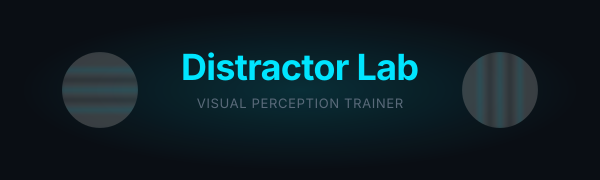
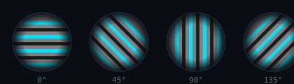
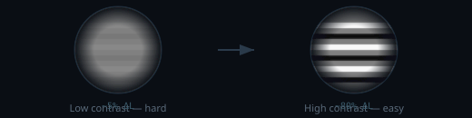
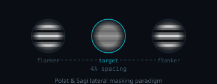

<p align="center">
  
</p>

<h3 align="center">Train your visual cortex with Gabor patches</h3>

<p align="center">
  Adaptive contrast sensitivity trainer · 6 game modes · Based on peer-reviewed research<br/>
  <a href="https://distractor.pages.dev">distractor.pages.dev</a>
</p>

---

## What is this?

**Distractor Lab** is a browser-based visual perception trainer built on **Gabor patches** — the gold-standard stimulus in vision science for over 50 years.

You identify the orientation of striped circular patterns. The difficulty adapts to your performance in real time. Your visual system does the rest.

> *"Gabor patches are the most widely used stimuli in visual neuroscience because they simultaneously activate a localized region of the visual cortex at a specific spatial frequency and orientation."*
> — Campbell & Robson, 1968

<p align="center">
  
</p>

---

## The Science

### Why Gabor patches?

A Gabor patch is a **sinusoidal grating** multiplied by a **Gaussian envelope**:

```
G(x, y) = cos(2π·f·(x·sinθ + y·cosθ)) · exp(-(x² + y²) / 2σ²)
```

This simple function has a remarkable property: it closely models the **receptive fields of neurons in the primary visual cortex (V1)** discovered by Hubel & Wiesel (1962). Each neuron responds to a specific orientation at a specific spatial frequency in a specific location — exactly what a Gabor patch probes.

<p align="center">
  
</p>

### Contrast Sensitivity

Your ability to distinguish subtle differences in contrast is called **contrast sensitivity**. It declines with age, amblyopia, refractive error, and neurological conditions — and it can be **trained back up**.

The key insight from perceptual learning research:

> Brief, repeated exposure to near-threshold stimuli triggers **long-term potentiation** in V1 neurons, permanently sharpening orientation and spatial frequency tuning.

### Adaptive Staircase

Distractor Lab uses a **3-down/1-up staircase**: three correct answers in a row make the task harder, one mistake makes it easier. This converges on your **75% threshold** — the sweet spot where learning happens fastest.

This is the same psychophysical method used in clinical vision testing (Levitt, 1971).

---

## Game Modes

<table>
  <tr>
    <td align="center"><h3>◎ Classic</h3>Adaptive contrast.<br>The foundational Gabor task.</td>
    <td align="center"><h3>≡ Frequency</h3>Spatial frequency varies.<br>Train across the CSF.</td>
    <td align="center"><h3>⊘ Noise</h3>Signal-in-noise detection.<br>Robustness training.</td>
  </tr>
  <tr>
    <td align="center"><h3>⇔ Tilt</h3>2AFC: left or right of vertical.<br>Hyperacuity-level precision.</td>
    <td align="center"><h3>⊕ Combo</h3>Random stimulus selection.<br>Generalist training.</td>
    <td align="center"><h3>≡ Lateral</h3>Collinear flanker masking.<br>Polat & Sagi paradigm.</td>
  </tr>
</table>

### Lateral Masking

The **Lateral** mode implements the **Polat & Sagi (1993)** paradigm: a low-contrast target Gabor flanked by two high-contrast collinear Gabors. At 4λ spacing, flankers **facilitate** detection in healthy vision but **impair** it in amblyopia — making this a powerful diagnostic and training stimulus.

<p align="center">
  
</p>

---

## Research Basis

Distractor Lab's parameters are grounded in published clinical research:

| Study | Paradigm | Key Finding |
|-------|----------|-------------|
| **Polat & Sagi (1993)** | Lateral masking | Collinear flankers facilitate detection at 4λ spacing |
| **Campbell & Robson (1968)** | CSF measurement | Gabor patches optimally probe spatial frequency channels |
| **Durrie & McMinn (2007)** | Gabor training | 30 sessions improved CSF at 1.5–18 cpd (NeuroVision RCT) |
| **Piñero et al. (2021)** | Gabor rehab | Significant contrast sensitivity improvement in trifocal IOL patients |
| **Levitt (1971)** | Adaptive staircase | 3-down/1-up converges on 75% threshold |

Full research analyses: [`docs/research/`](docs/research/)

---

## Tech Stack

- **SvelteKit 2** + **Svelte 5** (runes)
- **TypeScript** · strict mode
- **Canvas API** — pixel-level Gabor rendering, 60fps
- **Tailwind CSS v4**
- **PWA** — installable, works offline
- **i18n** — English / Russian
- **Haptics** — vibration feedback on mobile
- **Cloudflare Pages** — edge-deployed

---

## Getting Started

```sh
# Clone
git clone git@github.com:gitpash/distractor-lab.git
cd distractor-lab

# Install
bun install

# Dev
bun run dev

# Build
bun run build

# Test
bun run test
```

Open [http://localhost:5173](http://localhost:5173) — pick a mode, start training.

---

## Deployment

The app deploys automatically to **[distractor.pages.dev](https://distractor.pages.dev)** via Cloudflare Pages on every push to `main`.

To deploy manually:

```sh
bun run build
npx wrangler pages deploy .svelte-kit/cloudflare
```

---

## License

MIT
